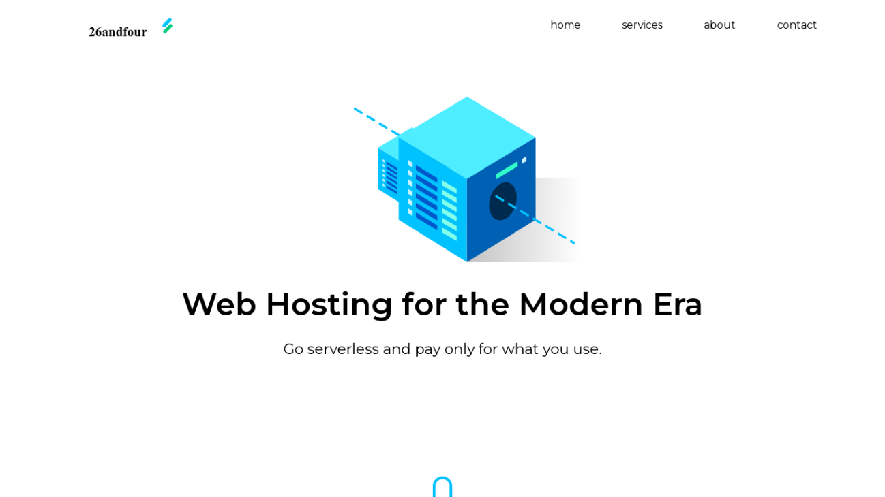

# 26andfour

This is a project created from a [YouTube crash course](https://youtu.be/8gNrZ4lAnAw) by Design Course. The aim of this project was to learn how HTML, CSS and JavaScript are used to build responsive websites.

## View Project

This project can be through this link [https://davidudo.github.io/26andfour_website_2020](https://davidudo.github.io/26andfour_website_2020/).