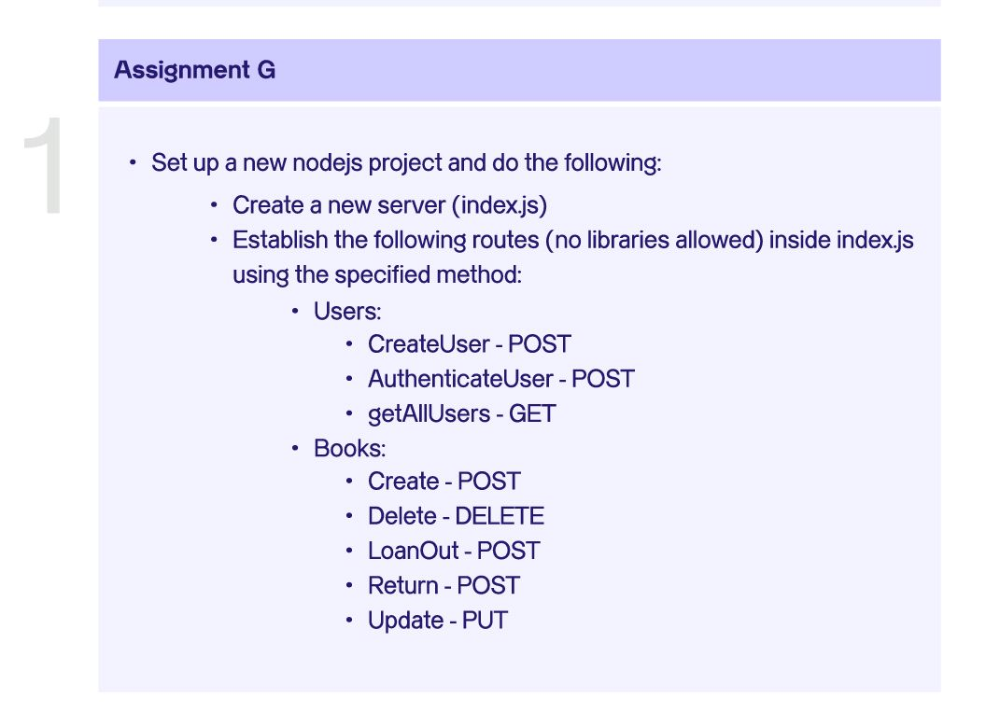

# White Board

This markdown file contains my design process for this project. All the white boarding process are available here. This is to help me understand the concept of the project before I start coding.

## The problem



## What do I need?

- An ```index.js``` file in the root directory.
- An ```index.html``` and ```main.js``` file in a static folder.
- Two routes, ```users.js``` and ```books.js```.
- Two databases ```users.json``` and ```books.json```.
- **Users** route needs to have the following:
  - createUser ```POST```
  - authenticateUser ```POST```
  - getAllUsers ```GET```
- **Books** route needs to have the following:
  - createBook ```POST```
  - deleteBook ```DELETE```
  - loanOutBooks ```POST```
  - returnBooks ```POST```
  - updateBook ```PUT```
