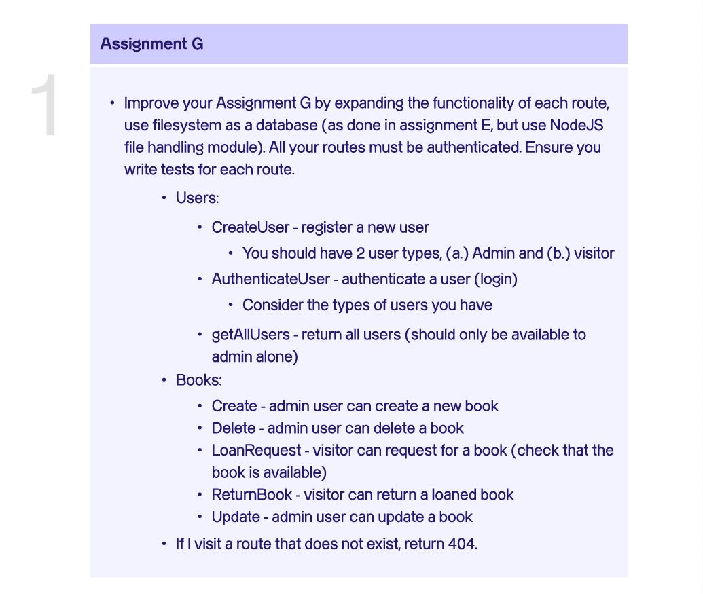

# Altschool Nodejs Project - Two

After learning **test driven development**, **authentication**, and **authorization** in the third week of the second semester in Altschool, I started building this project in order to test what have learned so far. This project is a modification of [altschool-nodejs-project-one](https://github.com/davidudo/altschool-nodejs-project-one).

## Table of contents

- [Overview](#overview)
  - [The project](#the-project)
  - [About project](#about-project)
  - [What changed](#what-changed)
  - [Usage](#usage)
- [My process](#my-process)
  - [Built with](#built-with)
  - [What I learned](#what-i-learned)
  - [Continued development](#continued-development)
  - [Useful resources](#useful-resources)
- [Author](#author)

## Overview

### The project



### About project

This is an API created with NodeJS. It can be classified into two main routes, the `users` routes and the `books` route. Each route contains the following methods and access control level authentication:

- **Users** route:
  - createUser ```POST``` <mark>[admin]</mark>
  - getAllUsers ```GET``` <mark>[admin, reader]</mark>
- **Books** route:
  - createBook ```POST``` <mark>[admin]</mark>
  - deleteBook ```DELETE``` <mark>[admin]</mark>
  - loanRequest ```POST``` <mark>[admin, reader]</mark>
  - returnBook ```POST``` <mark>[admin, reader]</mark>
  - updateBook ```PUT``` <mark>[admin]</mark>

Also, I built a basic frontend demo application that interacts with the API.

**NOTE:** While building the frontend demo, I discovered that only `GET` and `POST` methods worked, so the functions that work with `PUT` and `DELETE` methods were not functional.

### What changed

## Usage

Clone repository 

```bash
git clone https://<insert_your_token>@github.com/davidudo/altschool-nodejs-project-two
```

Change directory

```bash
cd altschool-nodejs-project-two
```

Install dependencies

```bash
npm install
```

Start server

```bash
npm run start:dev
```

Run test

```bash
npm run test
```

## My process

The design process I used to create this API is very simple. First of all I had to write down the basic files and folders I will need and list the files that will be contained in each folder. While writing the code, there were three main stages in my design process which were: 

- Setup server with a request handler
- Add routes to request handler and test them
- Add functionality to each route

### Built with

- Nodejs
- HTML

### What I learned

- How to setup a simple server with NodeJS
- Basics of authentication and access control level authentication 
- Code documentation
- How to consume API from frontend
- How to build a NodeJs CRUD app
- Basics of error handling
- How to categorise code files

### Continued development

In the next project, I will need to learn how to develop an API that can allow all methods from frontend applications. I want to discover why `Access-Control-Allow-Methods` did not work in my request handler when I sent a request from the frontend. Also in continued development, I will work on creating and effective authentication, book loaning and returning system.

### Useful resources

For the development of the frontend, I found this [resource](https://developer.mozilla.org/en-US/docs/Web/API/Fetch_API/Using_Fetch) very useful. It helped me understand how to send requests to the backend using different methods and also how to receive data from it.

## Author

- Twitter - [@_davidudo](https://www.twitter.com/_davidudo)
- LinkedIn - [David Udo](https://www.linkedin.com/in/david-udo-1713b3231)
