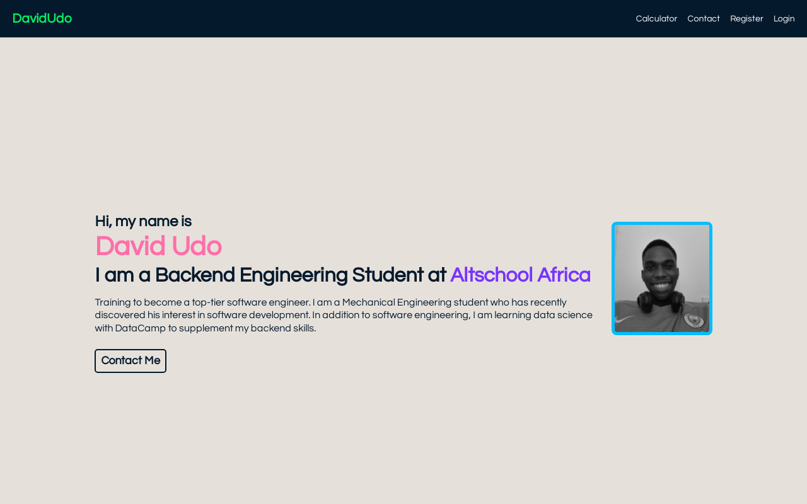

# Portfolio Website (Altschool Assignment)

This is my first Altschool assignment for the Frontend Engineering first semester. In this assignment we were instructed to create:

- a homepage that will contain the name of the student, his/her picture, a statement about the student, why the student is studying Software Engineering with Altschool, his/her hobbies, contact details, education and work experience.
- a contact form page
- a login form page, and
- a calculator 

## View Project

Thia project can be view through this link [https://davidudo.repl.co](https://davidudo.repl.co/)